<p align="center">
  
</p>

<h1 align="center">小i跑腿 · runningerrands</h1>

<p align="center">
  <a href="README.md">中文</a>
  ·
  <a href="README_EN.md">English</a>
</p>

<p align="center">
  
  
  
</p>

---

本项目是一个校园跑腿服务平台。平台提供从用户发布代取快递、代拿餐食、校内代办、代购物品等任务，到跑腿员接单配送完成等完整业务流程。整体项目主要包含微信小程序端（uni-app）、管理后台端（Vue 3）、服务后端（SpringBoot）。

---

## 技术栈

### 后端技术

| 技术 | 版本 | 说明 |
|------|------|------|
| Spring Boot | 3.2.0 | 应用框架 |
| Java | 21 | 开发语言 |
| MyBatis-Plus | 3.5.5 | ORM 框架 |
| MySQL | 8.0 | 关系型数据库 |
| Redis | 7 | 缓存 · 分布式锁 · 登录保护 |
| Redisson | 3.x | 分布式锁 |
| Knife4j | 4.5.0 | 接口文档（Swagger） |
| Maven | wrapper | 构建工具 |
| Lombok | 1.18.34 | 对象映射 |
| JWT | 0.12.6 | 双令牌认证（access + refresh） |

### 前端技术

| 技术 | 版本 | 说明 |
|------|------|------|
| Vue | 3.5 | UI 框架 |
| TypeScript | 6.0 | 开发语言 |
| Vite | 8 | 构建工具 |
| Vue Router | 4 | 路由管理 |
| Element Plus | 2.14 | UI 组件库 |
| Pinia | 3 | 状态管理 |
| ECharts | 6 | 数据图表 |
| GSAP | 3 | 动画引擎 |
| Axios | — | HTTP 客户端 |
| Iconfont | — | 图标库（阿里巴巴矢量图标库） |
| uni-app | — | 移动端跨端框架 |
| STOMP | 1.2 | 移动端 WebSocket 即时通讯 |

---

## 页面概览

### 管理端

<table>
<tr>

| 仪表盘 | 用户管理 | 认证审核 | 任务管理 |
|:------:|:------:|:------:|:------:|
| 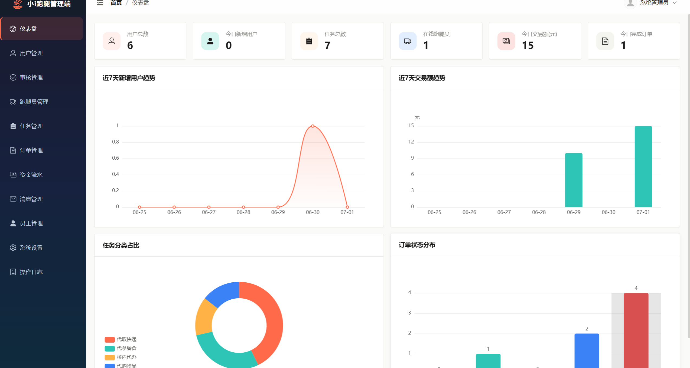 | 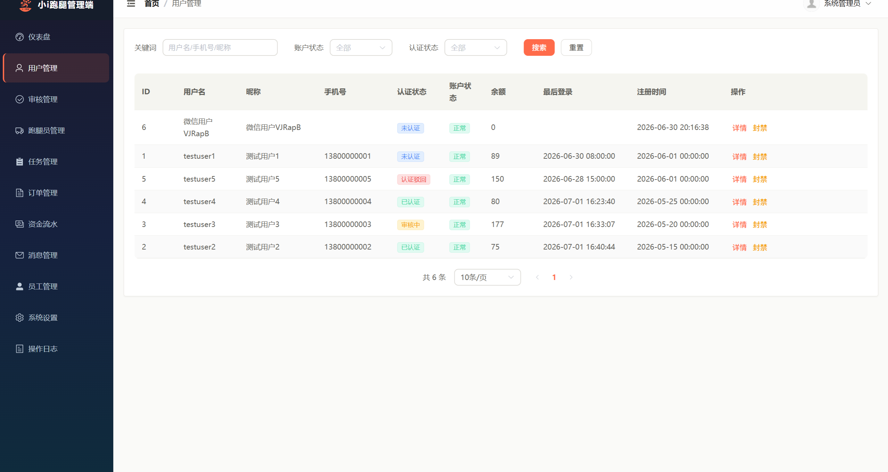 | 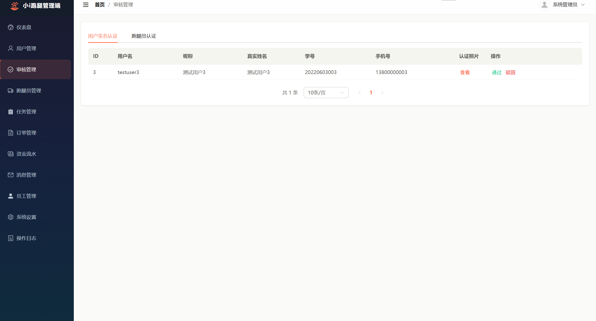 | 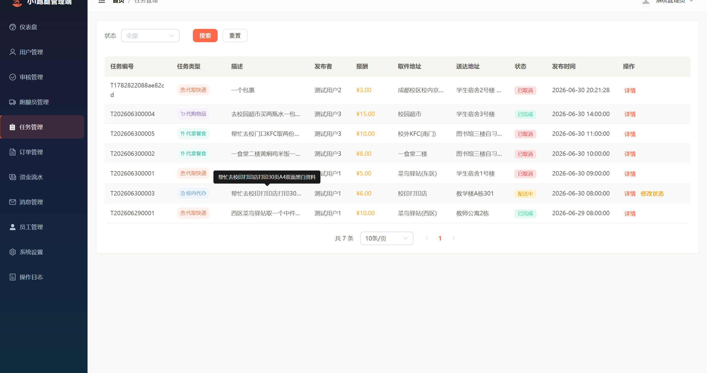 |

| 订单管理 | 交易流水 | 系统设置 | 消息设置 |
|:------:|:------:|:------:|:------:|
| 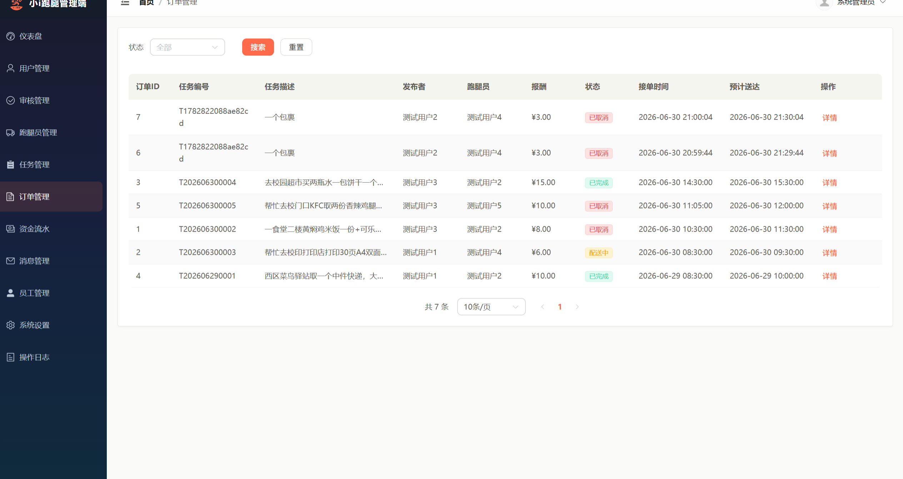 | 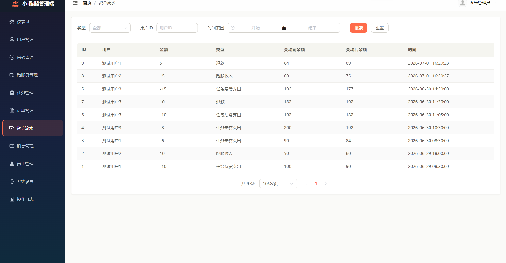 | 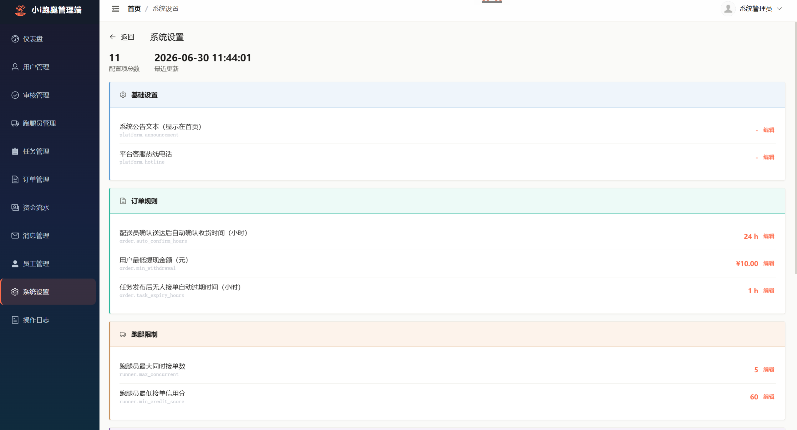 | 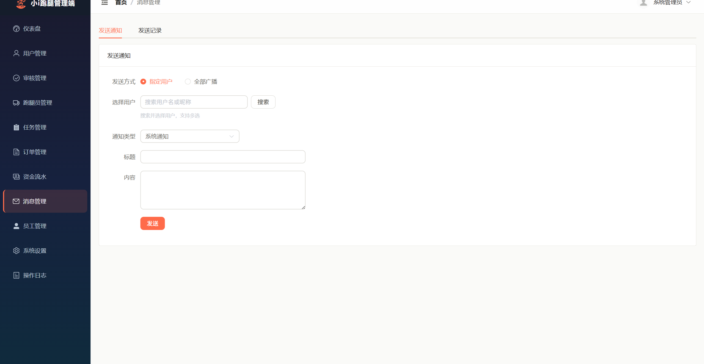 |

</tr>
</table>

### 移动端

<table>
<tr>

| 首页 | 任务大厅 | 任务发布 | 订单详情 |
|:------:|:------:|:------:|:------:|
| 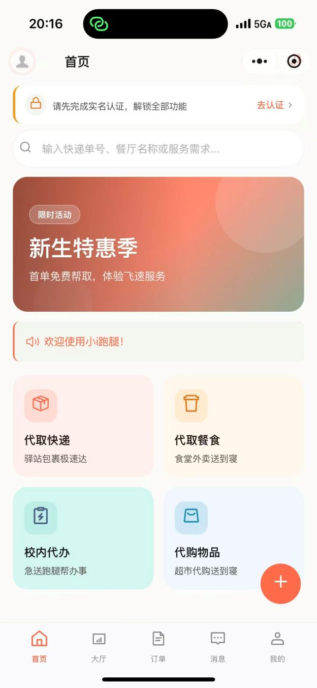 | 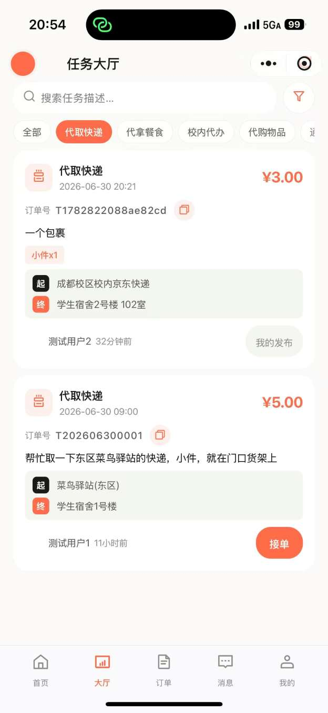 | 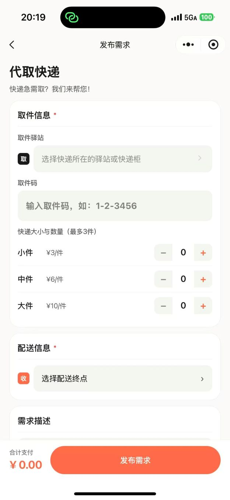 | 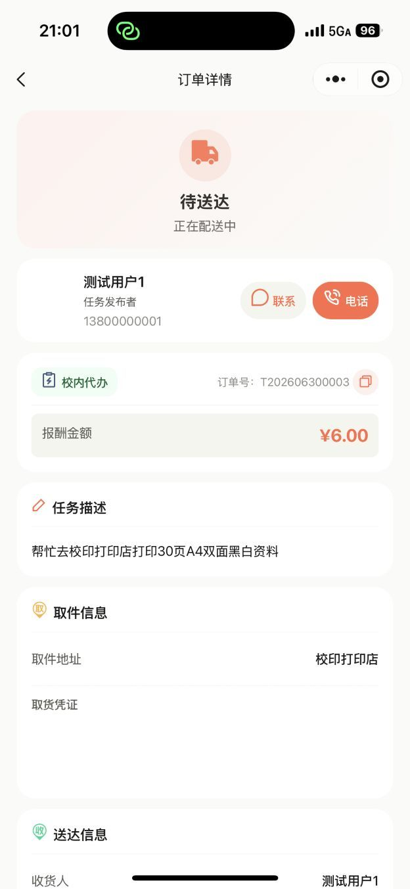 |

| 订单列表 | 消息中心 | 个人中心 | 跑腿员面板 |
|:------:|:------:|:------:|:------:|
| 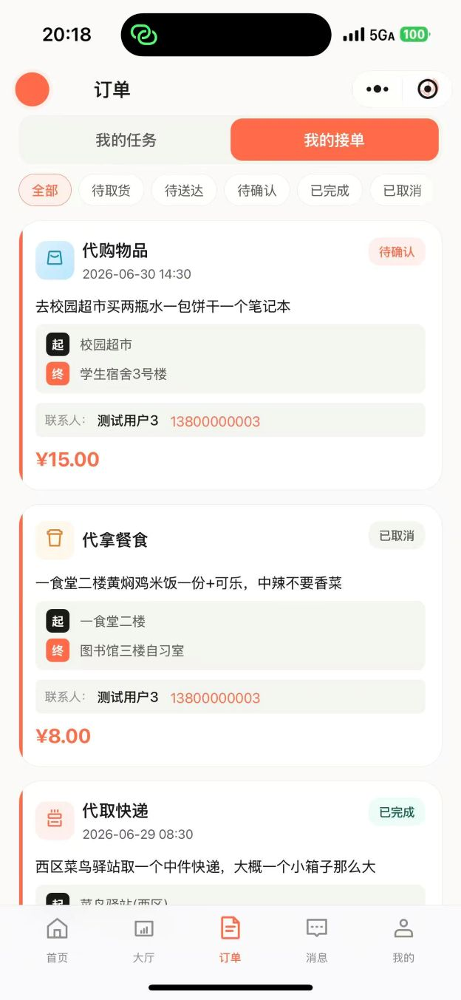 | 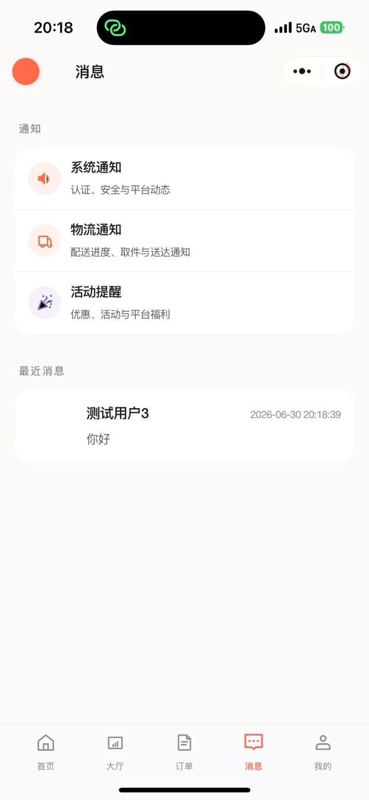 | 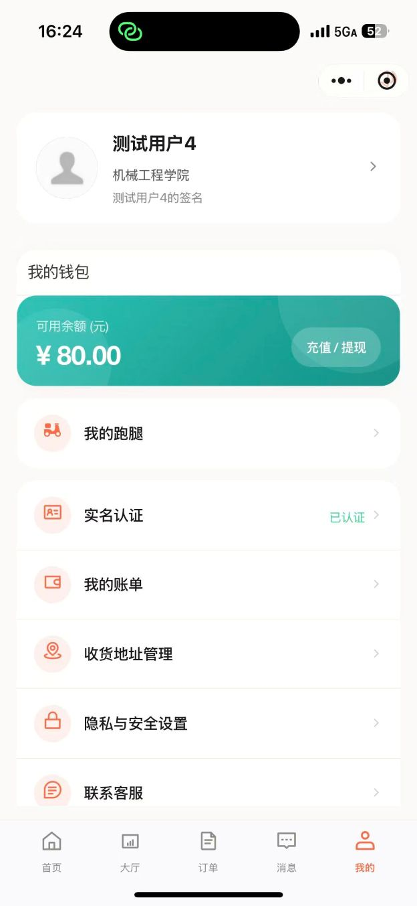 | 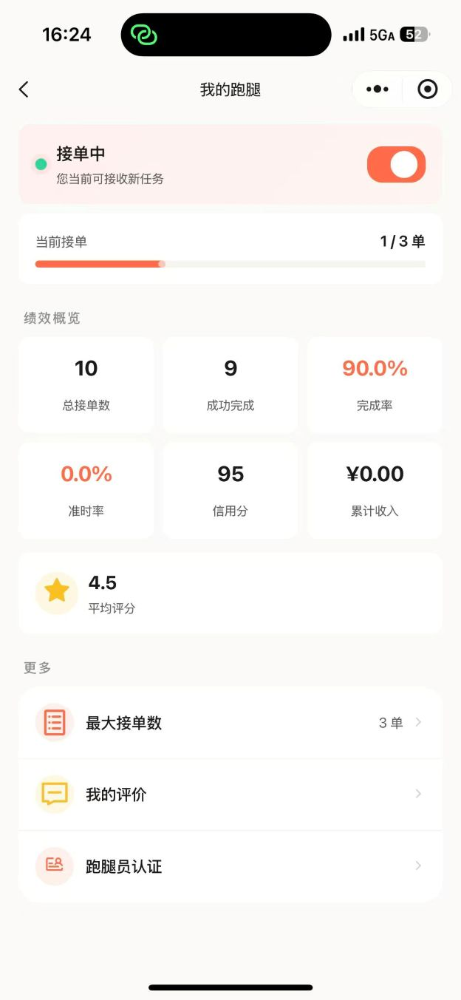 |

</tr>
</table>

---

## 项目结构

### 系统架构

<table><tr>

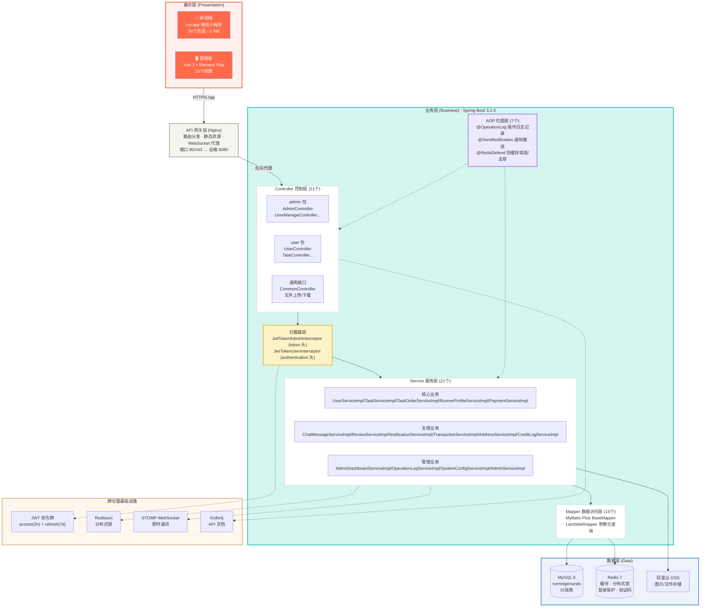

</tr></table>

### 请求生命周期

<table><tr>

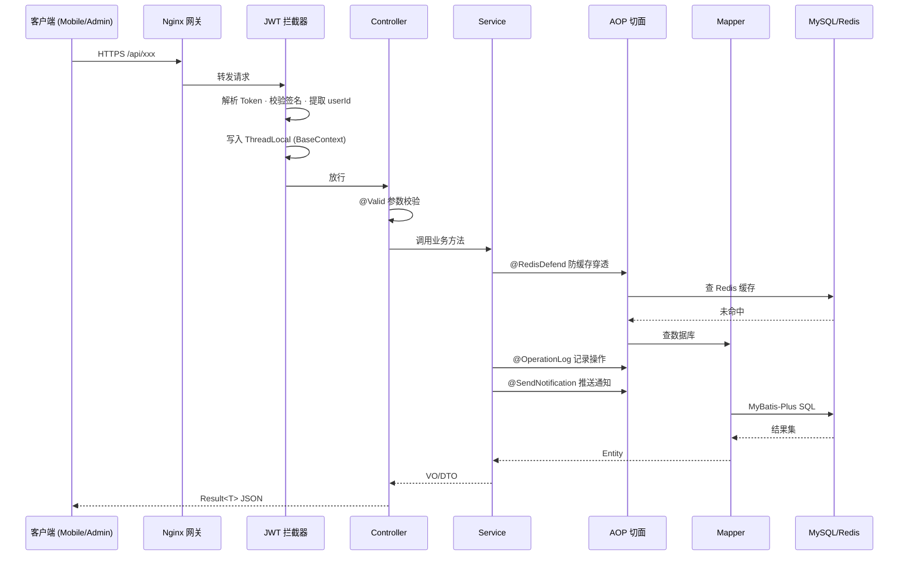

</tr></table>

### 订单状态机

<table><tr>

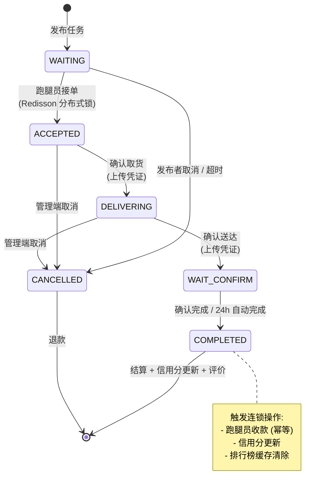

详见 [CLAUDE.md](.claude/CLAUDE.md) 获取完整项目规范。

---

## 环境要求

| 工具 | 版本 | 说明 |
|------|------|------|
| JDK | 21+ | 后端编译运行 |
| MySQL | 8.0+ | 主数据库 |
| Redis | 6.0+ | 缓存 + 分布式锁 + 登录保护 |
| Maven | 3.8+ | 或使用 `mvnw` wrapper |
| Node.js | 18+ / 22+ | 管理端前端 |
| HBuilderX | 最新版 | 移动端开发与编译 |
| 微信开发者工具 | 最新版 | 小程序调试 |

---

## 快速开始

### 方式一：Docker（推荐，无需配置外部服务）

```bash
cd docker
cp .env.example .env
docker compose up -d        # MySQL 8 + Redis 7 + Spring Boot + Nginx
```

首次启动自动建表 + 创建超管。详见 [docker/README.md](docker/README.md)。

### 方式二：本地开发

#### 1. 初始化数据库

```bash
mysql -u root -p < backend/runningerrands.sql
```

脚本创建 `runningerrands` 数据库及全部表结构，不含种子数据。首次启动后 `AdminInitializer` 自动创建超管账号。

### 2. 后端配置

```bash
cd backend

# 从模板复制开发环境配置
cp runningerrands-server/src/main/resources/application-template.yml \
   runningerrands-server/src/main/resources/application-dev.yml

# 编辑 application-dev.yml，填写本地数据库、Redis 等信息
# application-dev.yml 已在 .gitignore 中，不会被提交
```

**必须配置的环境变量**（或写在 `application-dev.yml` 中）：

| 变量 | 说明 | 示例 |
|------|------|------|
| `MYSQL_PASSWORD` | MySQL 密码 | `your_password` |
| `ALIYUN_ACCESS_KEY_ID` | 阿里云 AccessKey | `LTAI5t...` |
| `ALIYUN_ACCESS_KEY_SECRET` | 阿里云 AccessSecret | |
| `WECHAT_APP_ID` | 微信小程序 AppID | `wx74e8...` |
| `WECHAT_APP_SECRET` | 微信小程序 AppSecret | |
| `TENCENT_MAP_API_KEY` | 腾讯地图 WebService API Key | |
| `RUNNING_ERRANDS_JWT_ADMIN_SECRET` | 管理端 JWT 签名密钥 | 随机 32+ 位字符串 |
| `RUNNING_ERRANDS_JWT_USER_SECRET` | 用户端 JWT 签名密钥 | 随机 32+ 位字符串 |

```bash
# 编译 & 启动
./runningerrands-server/mvnw compile -q -DskipTests
./runningerrands-server/mvnw spring-boot:run
# 服务运行在 http://localhost:8080/api
# Swagger 文档：http://localhost:8080/api/doc.html
# 超管默认账号：admin / admin
```

### 3. 管理端前端

```bash
cd admin
npm install
npm run dev          # http://localhost:3001
```

Vite 自动将 `/api` 开头的请求代理到 `http://localhost:8080`，本地开发无需额外配置。

### 4. 移动端

1. HBuilderX 打开 `mobile/` 目录
2. 修改 `mobile/manifest.json` 中的微信小程序 AppID（`mp-weixin.appid`）
3. 修改 `mobile/utils/config.js` 中的后端地址（本地开发默认 `localhost:8080`）
4. 运行 → 微信小程序

### 5. 管理端 + Nginx 部署

```bash
# 1. 构建前端
cd admin
npm install
npx vite build              # 输出到 dist/

# 2. 将 dist/ 部署到 nginx 静态目录
# 项目已提供开箱即用的 nginx 配置：docker/nginx/nginx.conf
# 核心路由:
#   /api/admin/    → proxy_pass 后端 :8080
#   /api/user/     → proxy_pass 后端 :8080
#   /api/common/   → proxy_pass 后端 :8080
#   /api/ws/       → WebSocket 升级到后端
#   /api/assets/   → dist/assets/ (1 年强缓存)
#   /api/          → dist/index.html (SPA 兜底)

# 3. 启动 nginx
nginx -c F:/ikeu_runningerrands/docker/nginx/nginx.conf

# 4. 访问 http://localhost
# 管理端入口 → SPA 路由接管
# API 请求 → nginx 反向代理到 Spring Boot
```

> 本地开发时推荐直接 `npm run dev`（Vite HMR 热更新），无需 nginx。
> 构建部署用 nginx，生产配置见 [docker/nginx/nginx.conf](docker/nginx/nginx.conf)。

---

## 开发环境配置指南

### 环境架构

```
┌──────────────┐     ┌─────────────────┐     ┌──────────────┐
│  移动端 uni-app │────→│  后端 Spring Boot  │←────│  管理端 Vue 3  │
│  (微信开发者工具) │     │  :8080/api       │     │  :3001 → proxy │
│  config.js     │     │  application.yml │     │  vite.config.ts│
└──────────────┘     └─────────────────┘     └──────────────┘
```

### 后端环境切换

后端通过 `spring.profiles.active` 切换环境，配置在 `application.yml` 中：

```
application.yml              # 公共配置（所有环境共享）
application-template.yml     # 开发环境模板（提交到 git，新成员复制使用）
application-dev.yml          # 本地开发配置（.gitignore，每个开发者自己维护）
application-test.yml         # 测试环境配置（.gitignore）
application-prod.yml         # 生产环境配置（.gitignore，通过环境变量注入）
```

**切换方式**：

```bash
# 开发环境（默认）
./mvnw spring-boot:run

# 测试环境
./mvnw spring-boot:run -Dspring-boot.run.profiles=test

# 生产环境
./mvnw spring-boot:run -Dspring-boot.run.profiles=prod
```

### 前端 API 地址配置

项目支持两种开发模式：**本地直连**（推荐，最简单）和 **内网穿透**（需真机调试时使用）。

#### 方式一：本地直连（默认）

##### 管理端（Vite 代理）

编辑 `admin/vite.config.ts`：

```typescript
server: {
  port: 3001,
  proxy: {
    '^/api/(admin|user/|common|ws)': {
      target: 'http://localhost:8080',   // ← 指向你的后端地址
      changeOrigin: true,
    }
  }
}
```

##### 移动端（本地调试）

微信开发者工具内置了对 localhost 的支持，只需：

1. 开发者工具 → 详情 → 本地设置 → 勾选"不校验合法域名、web-view（业务域名）、TLS 版本以及 HTTPS 证书"
2. `mobile/utils/config.js` 中 `develop` 环境指向 `http://localhost:8080`

```javascript
develop: {
  SERVER_ORIGIN: 'http://localhost:8080',
}
```

#### 方式二：内网穿透（真机调试 / 外部设备访问）

当需要用真机扫码测试、或外部设备无法直接访问开发机时，使用 ngrok / frp / localtunnel 等内网穿透工具。

##### 1. 启动内网穿透

以 ngrok 为例：

```bash
# 启动 ngrok 隧道 → 后端端口
ngrok http 8080
# 输出：Forwarding  https://xxxx.ngrok-free.dev -> http://localhost:8080
```

##### 2. 修改前端配置

**管理端** `admin/vite.config.ts`：

```typescript
proxy
  '^/api/(admin|user/|common|ws)': {
    target: 'https://xxxx.ngrok-free.dev',   // ← 替换为你的 ngrok 地址
    changeOrigin: true,
    headers: {
      'ngrok-skip-browser-warning': 'true'    // 跳过 ngrok 浏览器警告
    }
  }
```

**移动端** `mobile/utils/config.js`：

```javascript
develop: {
  SERVER_ORIGIN: 'https://xxxx.ngrok-free.dev',   // ← 替换为你的 ngrok 地址
}
```

移动端 `mobile/utils/request.js` 中 `BASE_URL` 和 `WS_URL` 会自动从 `SERVER_ORIGIN` 拼接。WebSocket 协议也会自动从 `https` 转为 `wss`。

> **注意**：隧道地址是个人临时使用的，**不要提交到 git**。

### 移动端微信小程序 AppID 配置

每个开发者必须使用**自己的微信小程序 AppID**：

1. 登录 [微信公众平台](https://mp.weixin.qq.com) → 开发管理 → 开发设置 → 获取 AppID
2. 修改 `mobile/manifest.json`：
   ```json
   {
     "mp-weixin": {
       "appid": "wx你的小程序AppID"
     }
   }
   ```
3. 后端 `WECHAT_APP_ID` 和 `WECHAT_APP_SECRET` 需与此 AppID 一致

---

## 完整配置清单

新开发者接入项目时，需要修改以下个人相关配置：

### 后端配置项

| # | 文件 | 配置项 | 说明 |
|---|------|--------|------|
| 1 | `application-dev.yml` | `spring.datasource.*` | MySQL 连接信息 |
| 2 | `application-dev.yml` | `spring.data.redis.*` | Redis 连接信息 |
| 3 | `application-dev.yml` | `runningerrands.alioss.bucket-name` | 替换为自己的 OSS 桶名 |
| 4 | `application-dev.yml` | `runningerrands.sms.sign-name` | 替换为自己的短信签名 |
| 5 | `application-dev.yml` | `runningerrands.sms.template-code` | 替换为自己的短信模板 |
| 6 | `application.yml` | `runningerrands.jwt.admin-secret-key` | 设置随机密钥（通过环境变量） |
| 7 | `application.yml` | `runningerrands.jwt.user-secret-key` | 设置随机密钥（通过环境变量） |
| 8 | `application.yml` | `runningerrands.wechat.app-id` | 微信小程序 AppID |
| 9 | `application.yml` | `runningerrands.wechat.app-secret` | 微信小程序 AppSecret |
| 10 | `application.yml` | `runningerrands.map.api-key` | 腾讯地图 API Key |

### 前端配置项

| # | 文件 | 配置项 | 说明 |
|---|------|--------|------|
| 11 | `admin/vite.config.ts` | `target` | 代理目标后端地址（本地开发默认 localhost:8080） |
| 12 | `mobile/manifest.json` | `mp-weixin.appid` | 替换为你的微信小程序 AppID |
| 13 | `mobile/manifest.json` | `appid` | 替换为你的 DCloud appid |
| 14 | `mobile/utils/config.js` | `develop.trial.release` | 三环境后端地址 |

---

## 认证与权限

```
管理端：token 头 → JwtTokenAdminInterceptor → /admin/**
用户端：authentication 头 → JwtTokenUserInterceptor → /user/**
WebSocket：JwtHandshakeInterceptor → AuthChannelInterceptor
```

| 角色 | 值 | 权限范围 |
|------|-----|---------|
| 超级管理员 | 1 | 全部功能，包括员工管理、操作日志 |
| 普通管理员 | 2 | 仪表盘、用户/跑腿员/任务/订单/流水/消息管理、审核 |

注解权限控制：`@RequireRole({1, 2})` + `RoleCheckAspect` 切面。

---

## 测试

```bash
# E2E 快速验证（28 项 API 断言）
bash e2e/scripts/quick-verify.sh

# 订单全生命周期验证
python e2e/scripts/full_flow.py

# 完整流程编排
bash e2e/scripts/run.sh --quick
```

## 文档索引

| 文档 | 说明 |
|------|------|
| [CLAUDE.md](.claude/CLAUDE.md) | 项目规范 + 编码约定 + 常用命令 |
| [docs/versions/v1.0.0.md](docs/versions/v1.0.0.md) | v1.0.0 发布说明（功能全景 + 安全体系 + 已知限制） |
| [docs/changelogs/CHANGELOG.md](docs/changelogs/CHANGELOG.md) | 版本修复日志 |
| [docs/plans/v1.1-plan.md](docs/plans/v1.1-plan.md) | 后续迭代计划 |
| [docs/test_guide.md](docs/test_guide.md) | 测试环境部署 + E2E 测试指南 |
| [docs/触发路径设计图.md](docs/触发路径设计图.md) | 8 张控制层 → 服务层触发路径图 |
| [docs/项目架构设计图.md](docs/项目架构设计图.md) | Maven 模块 + 前后端 + 技术栈架构图 |
| [nginx.conf](nginx.conf) | 根目录 Nginx 部署配置，开箱即用 |
| [docker/README.md](docker/README.md) | Docker 部署指南 + 预置账号 + SMS 注入 |
| `http://localhost:8080/api/doc.html` | Swagger API 文档（启动后端后访问） |

## 注意事项

> [!IMPORTANT]
> 本项目当前处于 **个人开发者预览阶段**，以下功能受限于企业资质，已使用替代方案实现：

| 受限项 | 原因 | 当前替代方案 |
|--------|------|-------------|
| **微信支付** | 需要企业认证的小程序才能接入微信支付 API | 钱包余额为模拟数据；充值/提现接口已就绪但未对接真实支付渠道 |
| **支付 UI** | 支付接口未接入导致前端支付流程无法完整体验 | 支付密码弹窗、余额展示、流水记录等 UI 均已完成，仅缺后端对接收银台 |
| **SMS 短信** | 阿里云 SMS 需要已备案的企业主体 | Docker 环境通过 Redis 直写验证码；开发环境可复用 `e2e/scripts/bootstrap.sh` 注入 |
| **微信 OAuth** | 需要已上架的微信小程序 | 本地调试时可通过手机号验证码登录绕过；`DockerTestDataInitializer` 预置了测试账号 |

> 上述限制不影响项目 **核心业务流程**（注册→认证→跑腿员→发布→接单→取货→送达→完成→评价）的完整跑通和验证。

## 后续计划

| 优先级 | 功能 | 计划版本 |
|:--:|------|:--:|
| P0 | 排行榜 UI、账户注销页、附近任务（LBS）、任务统计 | v1.1 |
| P1 | 腾讯地图 SDK 接入（选点 + 路径规划） | v1.1 |
| P2 | 任务发布页组件化、订单详情 VO 统一 | v1.2 |
| P3 | 数据导出、仪表盘增强 | v1.2 |

详见 [docs/plans/v1.1-plan.md](docs/plans/v1.1-plan.md)。

---

## License

[MIT](LICENSE) © 2025–2026 ikeu
