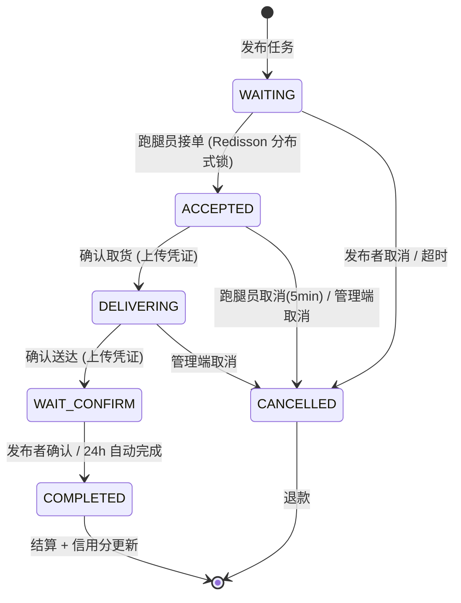

# 小i跑腿 v1.0.0 Release Notes

> **发布日期**：2026-07-02
> **代号**：First Flight
> **总提交数**：165 commits
> **开发周期**：2025.05 — 2026.07

---

## 项目简介

小i跑腿（runningerrands）是一个专为高校校园场景设计的跑腿服务微信小程序。学生发布代取快递、代拿餐食、校内代办、代购物品等任务，认证跑腿员接单配送。平台提供管理后台，支持用户审核、订单监控、系统配置等功能。

**三端架构**：微信小程序（uni-app）— 管理后台（Vue 3 + TypeScript）— Spring Boot 后端，REST API + STOMP WebSocket 实时通信。

---

## 核心功能

### 用户端（微信小程序 · 34 页 · 分包架构）

| 模块 | 功能点 |
|------|--------|
| **认证** | 手机号注册/登录、微信 OAuth、SMS 验证码、JWT 双令牌自动刷新 |
| **安全** | 支付密码（BCrypt）、SMS 跨操作隔离（5 种 Redis key）、暴力破解锁定（5次/300s）、密码重置保护 |
| **实名** | 学生证上传 → 管理端审核（通过/驳回 + 备注） |
| **跑腿员** | 申请→审核→上线/离线、信用分体系（100→扣分→冻结→恢复）、接单上限可配、排行榜、数据面板 |
| **钱包** | 充值/提现（支付密码校验）、余额冻结（SELECT FOR UPDATE）、幂等保护（payment_idempotent + DB UNIQUE） |
| **地址簿** | 双校区联动选择器（校区→楼栋→楼层→房间）、默认地址 |
| **任务系统** | 5 种任务类型 × 15 子类型（见下表） |
| **订单** | 接单→取货（凭证）→送达（凭证）→确认→自动结算→互相评价+追评 |
| **聊天** | STOMP WebSocket 实时通信、乐观消息替换、撤回/删除 |
| **草稿** | 5 个发布页自动保存（2s 防抖、30min TTL） |

### 分包架构

```
主包 pages/ (7):  login, index, task-hall, orders, message, user-profile, account-login
子包 pages-order/ (7):       order-waiting, order-delivering, order-completed, order-success, general-publish, cancel-reason, station-select
子包 pages-service/ (4):     coffee-order, print-order, paper-express, service-publish
子包 pages-user/ (9):        wallet, bills, runner-cert, certify, phone-edit, identity-verify, password-manage, privacy-security, profile-settings
子包 pages-social/ (5):      chat-detail, notifications, runner-dashboard, runner-reviews, runner-profile
子包 pages-address/ (2):     address-list, address-edit
```

preloadRule：首页预加载 order+service，订单页预加载 order，个人页 WiFi 预加载 user。

### 任务类型矩阵

| 类型 | 子类型 | 核心字段 |
|------|--------|---------|
| 代取快递 | 小件/中件/大件 | 驿站选择 → 包裹规格×数量 → 取件码 |
| 代拿餐食 | 校内/校外/奶茶咖啡 | 商家 → 餐品 → 取餐码 |
| 校内代办 | 物品急送/办事代排/图书馆还书/资料打印/自定义 | 动态表单 |
| 代购物品 | 校内代购/校外代购 | 商品清单 → 预估商品费 |
| 通用代办 | — | 自由描述 → 取送地址 |

### 管理端（Vue 3 · 13 页 · RBAC）

| 页面 | 角色 | 核心功能 |
|------|:--:|------|
| 仪表盘 | 1,2 | 6 统计卡片（GSAP 动画）+ 4 ECharts 图表 |
| 用户管理 | 1,2 | 列表+详情+禁用/启用 |
| 认证审核 | 1,2 | 双 Tab（用户认证+跑腿员认证）→ 通过/驳回 |
| 跑腿员管理 | 1,2 | 列表（信用分颜色分级）+ 详情+封禁/解封 |
| 任务管理 | 1,2 | 列表+详情+状态强制变更（状态机约束） |
| 订单管理 | 1,2 | 列表+详情（时间线+凭证+手机号脱敏） |
| 交易流水 | 1,2 | 筛选+明细 |
| 消息管理 | 1,2 | 定向推送+全量广播+发送历史 |
| 员工管理 | **1** | CRUD + 启用/禁用 + 密码重置 |
| 系统设置 | **1** | 6 分组卡片内联编辑 + 轮播图管理 |
| 操作日志 | **1** | 筛选 + 展开行（敏感字段脱敏） |

---

## 订单状态机



**关键机制**：
- **分布式锁**：Redisson RLock 防并发抢单（等待 3s / 持有 10s / 持锁后双检）
- **竞态防护**：ORDER_LOCK_KEY 统一保护接单、取消、超时、管理端操作，锁内重查防 TOCTOU
- **信用分**：送达时清算（deliverTime vs expectFinishTime）— 提前 +5 / 准时 +1 / 延迟 0-30min -2 / 30-60min -5 / 60min+ -10 / 低于阈值冻结 3 天
- **支付幂等**：payment_idempotent 表 + DB UNIQUE 约束，5 个资金方法全覆盖
- **定时任务**：任务超时取消(30s) + 订单超时取消(30s) + 自动完成(60s) + 信用分恢复(5min) + 通知清理 + 幂等记录清理

---

## 发行前关键修复

以下为 v1.0.0 发行前最终审查中发现并修复的关键问题：

| 优先级 | 问题 | 文件 | 状态 |
|:--:|------|------|:--:|
| P0 | 管理员强制完成任务未付款 | `AdminTaskServiceImpl` | ✅ |
| P0 | OrderTimeoutChecker 退单任务状态竞态覆盖 | `OrderTimeoutChecker` | ✅ 加 ORDER_LOCK_KEY |
| P1 | 订单强更 RBAC 不对等（管理员可改订单状态） | `AdminOrderController` | ✅ 收紧为仅超管 |
| P1 | 任务大厅 type/subType/reward 过滤未生效 | `TaskServiceImpl.queryHallTasks` | ✅ |
| P1 | @Transactional 自调用失效（autoCompleteOrder） | `OrderAutoCompleteChecker` → `TaskOrderService` | ✅ |
| P1 | @Transactional 自调用失效（createFollowUp） | `ReviewServiceImpl` | ✅ |
| P1 | 6 个 Service 接口缺失异常导包 | `Admin*Service` | ✅ |
| P1 | AdminOrderServiceImpl 完成/取消漏 decrementCurrentOrders | `AdminOrderServiceImpl` | ✅ |
| P2 | CSP 缺少 ws: wss: | `vite.config.ts` + 重建 static | ✅ |
| P2 | subType String→Integer 误转 | `TaskServiceImpl` 回退 | ✅ |
| P2 | 信用分从 confirmComplete 移至 confirmDeliver | `CreditScoreAspect` + `CreditServiceImpl` | ✅ |
| P2 | acceptOrder 锁内未重检跑腿员状态 | `TaskOrderServiceImpl` | ✅ |
| P2 | 管理端完成漏 incrementCompletedStats | `AdminTaskServiceImpl` | ✅ |
| — | 移动端 34 页重构为 5 子包 | `pages.json` + 27 页面移动 | ✅ |
| — | 中英文 README + CLAUDE.md + PR 模板同步 | 文档 | ✅ |

---

## 安全保障

| 维度 | 措施 |
|------|------|
| **传输** | CSP (connect-src 'self' ws: wss:), X-Frame-Options DENY, HSTS |
| **认证** | 管理端/用户端独立 JWT 密钥，access 2h + refresh 7d 令牌轮换 |
| **密码** | BCrypt 加密，支付密码独立 6 位数字 |
| **限流** | IP 级 Redis 计数器：SMS 5/min, 登录 10/min |
| **锁定** | 登录/密码重置 5 次失败锁定 300s，独立 Redis key |
| **验证码** | 5 种 operation 各读各的 key，一次性消费 |
| **支付** | SELECT FOR UPDATE 行锁 + payment_idempotent UNIQUE 约束 |
| **审计** | 全操作日志（模块/动作/参数/IP），敏感字段自动脱敏 |
| **数据** | 非超管手机号脱敏，日志敏感字段打码 |

---

## 技术栈

| 层 | 技术 | 版本 |
|------|------|------|
| 后端框架 | Spring Boot | 3.2.0 |
| 语言 | Java | 21 |
| ORM | MyBatis-Plus | 3.5.5 |
| 数据库 | MySQL | 8.0 |
| 缓存 | Redis + Redisson | 7 |
| 认证 | JWT (jjwt) | 0.12.6 |
| 文档 | Knife4j + springdoc | 4.5.0 |
| 管理端 | Vue 3 + TypeScript + Element Plus | 3.5 / 6.0 / 2.14 |
| 构建 | Vite | 8 |
| 图表 | ECharts + vue-echarts | 6 |
| 动画 | GSAP | 3 |
| 移动端 | uni-app (Vue 3) | — |
| 通信 | STOMP 1.2 (自制客户端) | — |
| 部署 | Docker Compose + Nginx | — |

---

## 项目规模

| 维度 | 数量 |
|------|:--:|
| 后端模块 | 3（common / model / server） |
| Controller | 21（admin 11 + user 9 + common 1） |
| Service 接口/实现 | 21 / 21 |
| Mapper | 15 |
| Aspect | 7 |
| Interceptor | 4 |
| 定时任务 | 6 |
| 数据库表 | 15 |
| 管理端页面 | 13 |
| 移动端页面 | 34（主包 7 + 5 子包 27） |
| E2E 测试脚本 | 7 |
| 文档 | 发行说明 + 触发路径图 + 架构设计图 + CHANGELOG + 测试指南 + v1.1 计划 |

---

## 已知限制

| 项目 | 状态 |
|------|:--:|
| 排行榜 UI | 后端就绪，planned v1.1 |
| 账户注销页 | 后端就绪，planned v1.1 |
| 附近任务（LBS） | 后端就绪，planned v1.1 |
| 任务统计 | 后端就绪，planned v1.1 |
| 腾讯地图 SDK 接入 | Planned v1.1 |
| 微信订阅消息推送 | Planned v1.2 |
| 数据导出 | Planned v1.2 |
| 企业认证（微信支付/真实 SMS） | 个人开发者预览阶段 |

---

## 团队

| 角色 | 人员 |
|------|:--:|
| 全栈开发 | ikeu |
| 开发周期 | 2025.05 — 2026.07 |

---

## 许可

[MIT License](../../LICENSE) © 2025–2026 ikeu
