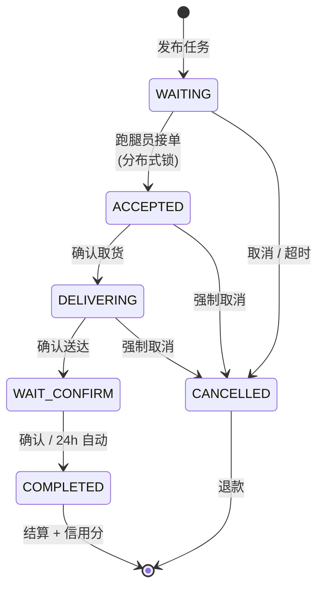

# 小i跑腿 v1.0.0 Release Notes

> **发布日期**：2026-06-22  
> **代号**：First Flight  
> **定位**：面向高校校园的一站式跑腿服务平台

---

## 项目简介

小i跑腿（runningerrands）是一个专为高校校园场景设计的跑腿服务微信小程序。学生用户可发布代取快递、代拿餐食、校内代办、代购物品等任务，认证跑腿员接单配送。平台提供管理后台，支持用户审核、订单监控、系统配置等功能。

**三端架构**：微信小程序（uni-app）→ 管理后台（Vue 3）→ Spring Boot 后端，全部通过 REST API + WebSocket 实时通信。

---

## 技术架构

```
┌──────────────────────────────────────────────────────┐
│                    客户端层                           │
│  ┌──────────────────┐  ┌──────────────────────────┐  │
│  │  微信小程序        │  │  管理后台 (Vue 3 + TS)     │  │
│  │  uni-app (Vue 3)  │  │  Element Plus + ECharts  │  │
│  │  5 Tab 毛玻璃导航   │  │  17 页数据管理面板        │  │
│  └────────┬─────────┘  └───────────┬──────────────┘  │
│           │ HTTP + STOMP            │ HTTP             │
├───────────┼────────────────────────┼──────────────────┤
│           ▼                        ▼                  │
│  ┌─────────────────────────────────────────────────┐  │
│  │              网关 / Nginx (反向代理)              │  │
│  └─────────────────────┬───────────────────────────┘  │
│                        │                              │
├────────────────────────┼──────────────────────────────┤
│                        ▼                服务层         │
│  ┌─────────────────────────────────────────────────┐  │
│  │          Spring Boot 3.2.0 (Java 21)            │  │
│  │  ┌──────────┐ ┌──────────┐ ┌────────────────┐   │  │
│  │  │ 17 控制器 │ │ 21 服务  │ │ 13 个 Mapper    │   │  │
│  │  │admin/user │ │接口+实现  │ │ MyBatis-Plus   │   │  │
│  │  └──────────┘ └──────────┘ └────────────────┘   │  │
│  │  ┌──────────┐ ┌──────────┐ ┌────────────────┐   │  │
│  │  │ JWT 双拦截│ │ 8 个切面  │ │ 6 个定时任务    │   │  │
│  │  │器+RBAC   │ │ AOP 增强  │ │ 超时/结算/清理  │   │  │
│  │  └──────────┘ └──────────┘ └────────────────┘   │  │
│  └─────────────────────┬───────────────────────────┘  │
│                        │                              │
├────────────────────────┼──────────────────────────────┤
│                        ▼                数据层         │
│  ┌──────────┐  ┌──────────┐  ┌──────────────────┐    │
│  │ MySQL 8  │  │ Redis 7  │  │ Alibaba Cloud    │    │
│  │ 14 张表  │  │缓存/锁/限流│  │ OSS + SMS + 地图 │    │
│  └──────────┘  └──────────┘  └──────────────────┘    │
└──────────────────────────────────────────────────────┘
```

### 技术选型

| 层 | 技术 | 选型理由 |
|------|------|---------|
| 后端框架 | Spring Boot 3.2.0 + Java 21 | 虚拟线程就绪，长期支持 |
| ORM | MyBatis-Plus 3.5.5 | Lambda 查询防 SQL 注入，自动填充 |
| 缓存 | Redis + Redisson | 分布式锁 + 缓存穿透/击穿防护 |
| 认证 | JWT 双令牌 (access 2h + refresh 7d) | 无状态横向扩展，令牌轮换防重放 |
| 管理端 | Vue 3 + TypeScript + Element Plus | 组合式 API，类型安全 |
| 移动端 | uni-app (Vue 3) + 微信小程序 | 跨端能力，热更新 |
| 实时通信 | STOMP over WebSocket (自制客户端) | 轻量级消息协议，心跳保活 |
| API 文档 | Knife4j (Swagger) + springdoc-openapi | 可视化调试界面 |
| 部署 | Docker Compose | 一键启动 MySQL + Redis + Backend |

---

## 功能全景

### 用户端（微信小程序 · 34 页）

| 模块 | 功能点 |
|------|--------|
| **认证** | 手机号注册/登录、微信 OAuth 一键登录、SMS 验证码登录、双令牌自动刷新 |
| **安全** | 支付密码（BCrypt 加密）、SMS 跨操作隔离（5 种各读各的 Redis key）、暴力破解锁定（5次/300s） |
| **实名** | 学生证照片上传 → 管理端审核（通过/驳回+备注） |
| **跑腿员** | 申请→审核→上线/离线、信用分体系（100→扣分→冻结→恢复）、接单上限可配、排行榜 |
| **钱包** | 充值/提现（支付密码校验）、余额冻结、幂等保护（DB idempotent 表 + Redis key） |
| **地址簿** | 双校区联动选择器（校区→楼栋→楼层→房间）、默认地址 |
| **任务系统** | 5 种任务类型覆盖校园全场景（详见下文） |
| **订单** | 接单→取货（上传凭证）→送达（上传凭证）→确认→自动结算→互相评价+追评 |
| **聊天** | STOMP WebSocket 实时通信、乐观消息替换、撤回/删除/多选、联系人列表 |
| **首页** | 轮播图（秒级内存缓存 + 管理端远程配置）、公告滚播、GSAP 入场动画 |

### 任务类型矩阵（5 种 × 15 子类型）

| 类型 | 子类型 | 核心字段 |
|------|--------|---------|
| 代取快递 | 小件/中件/大件 | 驿站选择 → 包裹规格×数量 → 取件码 |
| 代拿餐食 | 校内/校外/奶茶咖啡 | 商家 → 餐品 → 取餐码 |
| 校内代办 | 物品急送/办事代排/图书馆还书/资料打印/自定义 | 动态表单（物品重量/服务时长/打印规格） |
| 代购物品 | 校内代购/校外代购 | 商品清单（名称×数量） → 预估商品费 → 采购地点 |
| 通用代办 | — | 自由描述 → 取送地址 → 额外费用 |

### 订单状态机



关键机制：
- **分布式锁**：Redisson RLock 防并发抢单（等待3s/持有10s/持锁后双检）
- **自动结算**：24h 未确认→自动完成→支付跑腿员报酬
- **信用分**：提前+5 / 准时+1 / 延迟 -2~-10 / 60 分冻结接单
- **支付幂等**：`payment_idempotent` 表 + Redis idempotent keys 防重复扣款

### 管理端（Vue 3 · 13 页）

| 页面 | 角色 | 核心功能 |
|------|:--:|------|
| 仪表盘 | 1,2 | 6 统计卡片（GSAP 递增动画） + 4 ECharts 图表（用户趋势/收入/分类/状态分布） |
| 用户管理 | 1,2 | 列表（搜索+筛选+分页）+ 详情（3 卡片块式布局+CSS 入场动画）+ 禁用/启用 |
| 认证审核 | 1,2 | 双 Tab（用户认证+跑腿员认证）→ 通过/驳回（+备注） |
| 跑腿员管理 | 1,2 | 列表（信用分颜色分级）+ 详情（信用等级徽章）+ 封禁/解封 |
| 任务管理 | 1,2 | 列表（类型标签彩色图标）+ 详情（费用分解 Popover）+ 状态强制变更（状态机约束） |
| 订单管理 | 1,2 | 列表+详情（7 卡片+时间线+取货/送达凭证+非超管手机号脱敏） |
| 交易流水 | 1,2 | 筛选（类型+用户+时间范围）+ 明细 |
| 消息管理 | 1,2 | 双 Tab（定向推送+全量广播+发送历史） |
| 员工管理 | **1** | CRUD + 启用/禁用 + 密码重置（禁止自操作） |
| 系统设置 | **1** | 6 分组卡片内联编辑 + 轮播图管理（上传/排序/删除/间隔+OSS 直传） |
| 操作日志 | **1** | 筛选（模块+时间）+ 展开行（敏感字段脱敏） |

### RBAC 权限模型

```
role=1 (超管)  → 全部功能 + 员工管理 + 系统设置 + 操作日志
role=2 (普通)  → 仪表盘/用户/跑腿员/任务/订单/流水/消息/审核（禁用增删改敏感操作）

路由级：meta.role: [1] 控制页面可见性
按钮级：v-if="authStore.adminInfo.role === 1" 控制操作权限
数据级：非超管手机号显示 XXXX****XXXX 格式
```

---

## 安全保障

| 维度 | 措施 |
|------|------|
| **传输** | HSTS (max-age=31536000), CSP (default-src 'self'), X-Frame-Options DENY |
| **认证** | 管理端/用户端独立 JWT 密钥，access 2h + refresh 7d 令牌轮换，WebSocket 握手 JWT 校验 |
| **密码** | BCrypt 加密存储，强密码（8+位），支付密码独立（6 位数字） |
| **限流** | IP 级 Redis 计数器：SMS 5/min, 登录 10/min, 刷新 10/min, 无条件设 expire 防永久 key |
| **锁定** | 登录/重置密码/重置支付密码 5 次失败锁定 300s, 独立 Redis key 互不干扰 |
| **验证码** | 5 种 operation（login/register/change_phone/reset_password/reset_pay_password）各读各的 Redis key，一次性消费 |
| **文件** | 白名单后缀（12 种），5MB 单文件限制，每用户每日限额，UUID 随机文件名 |
| **数据** | PII 脱敏（非超管手机号/姓名/学号掩码），日志敏感字段自动打码 |
| **支付** | 余额冻结（SELECT FOR UPDATE 行锁），交易幂等（DB 表 + Redis key 双重保障） |
| **审计** | 全操作日志记录（模块/动作/参数/IP），敏感参数自动脱敏 |

---

## 自动化运维

| 类型 | 内容 | 频率 |
|------|------|------|
| 定时任务 | 任务超时取消（退款）+ 订单超时取消 + 自动完成（24h）+ 信用分恢复 + 通知清理 + 幂等记录清理 | 30s ~ 每日 |
| 启动检查 | JWT 密钥强度校验（≥32 字节，拒绝弱密钥）+ 超管自动初始化 | 启动时 |
| 健康端点 | `/api/actuator/health` — MySQL + Redis 连通性 | 实时 |
| 缓存策略 | 仪表盘 @Cacheable/@CacheEvict 全量清除，任务大厅 @RedisDefend 穿透/击穿防护 | 60s~600s TTL |

---

## 项目规模

| 维度 | 数量 |
|------|:--:|
| 后端模块 | 3（common / model / server） |
| Controller | 17（6 admin + 10 user + 1 common） |
| Service 接口/实现 | 21 / 21 |
| Mapper | 13 |
| REST API 端点 | ~100 |
| 数据库表 | 14（user, task, task_order, transaction_record, review, notification, chat_message, runner_profile, admin, user_address, system_config, operation_log, credit_log, payment_idempotent） |
| 管理端页面 | 13 |
| 移动端页面 | 34 |
| 移动端组件 | 6 |
| 切面 | 8（通知推送、操作日志、角色检查、跑腿员状态自动变更、信用分结算、排队等待等） |
| 定时任务 | 6 |

---

## 已知限制

| 项目 | 状态 |
|------|:--:|
| 排行榜 UI | 后端就绪，前端 planned v1.1 |
| 账户注销 UI | 后端就绪，前端 planned v1.1 |
| 附近任务（LBS） | 后端就绪，前端 planned v1.1 |
| 任务统计 UI | 后端就绪，前端 planned v1.1 |
| 腾讯地图 SDK | Planned v1.1 |
| 服务端推送（微信订阅消息） | Planned v1.2 |
| 数据导出（CSV/Excel） | Planned v1.2 |

---

## 团队

| 角色 | 人员 |
|------|:--:|
| 全栈开发 | ikeu |
| 项目周期 | 2025.05 — 2026.06（13 个月） |

---

## 许可

[MIT License](../../LICENSE) © 2026 ikeu
