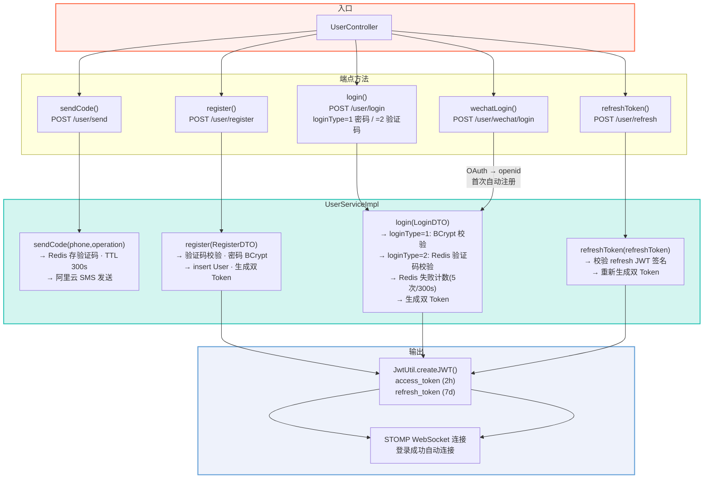
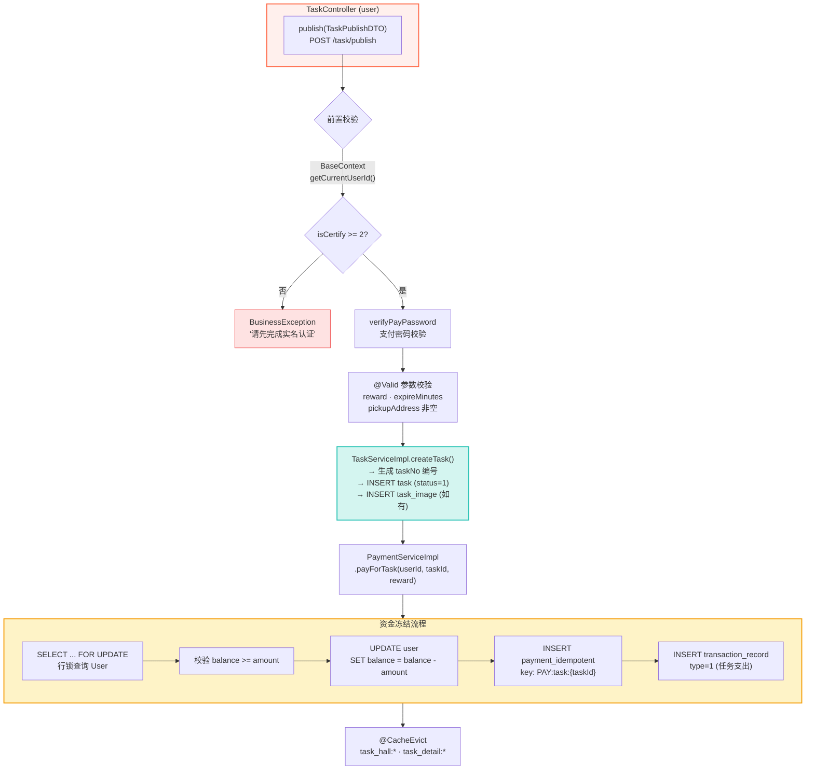
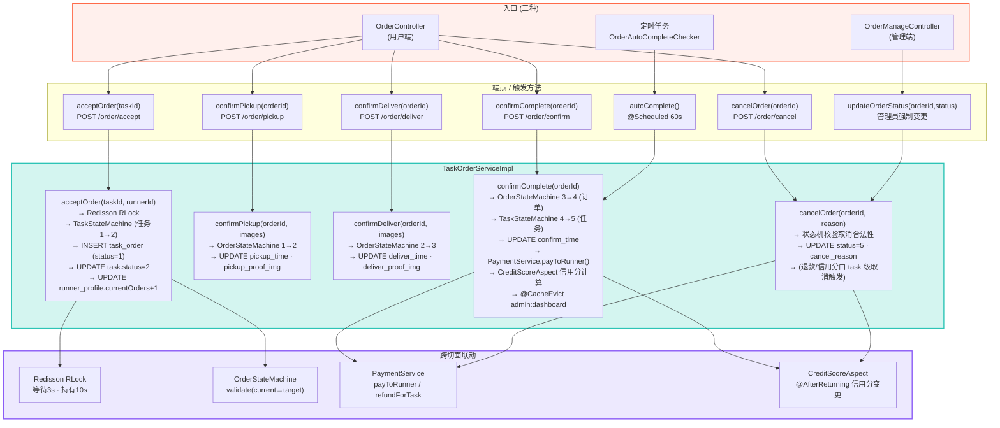
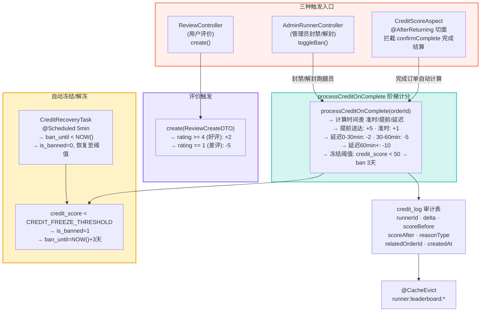
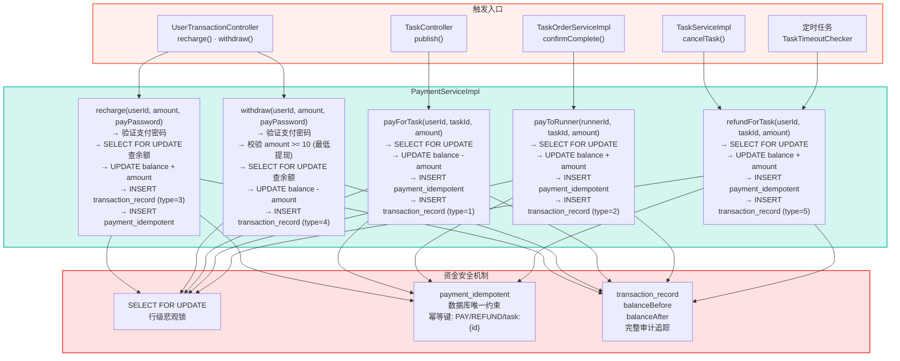
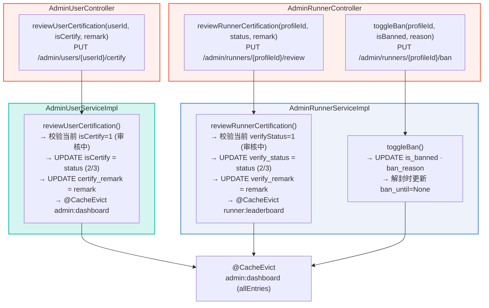
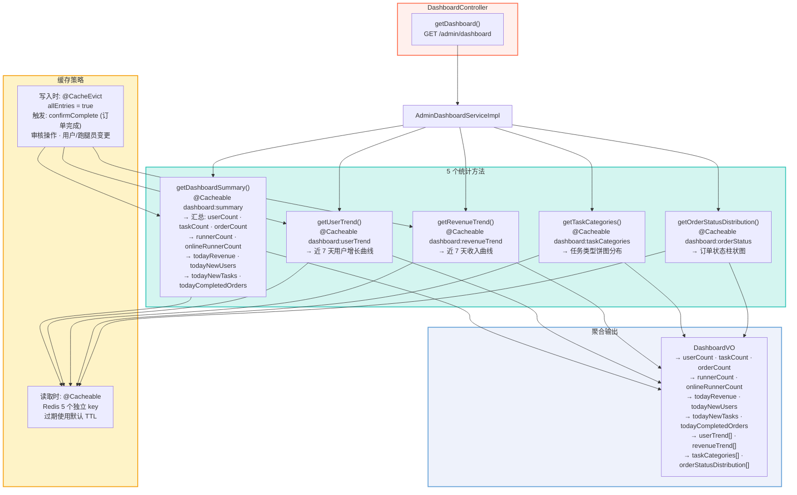
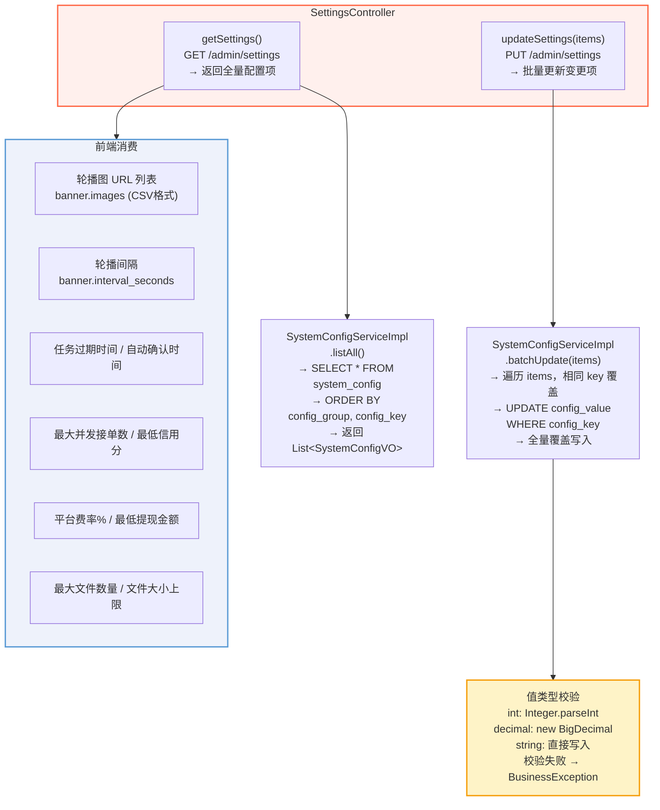

# 控制层触发路径示意图

> 以下 Mermaid 流程图展示各核心业务场景中，控制层（Controller/AOP/定时任务）到服务层的完整触发路径与数据流向。

---

## 用户注册与登录触发路径

> 三条认证路径（密码登录 / 验证码登录 / 微信OAuth）汇聚到 JWT 双 Token 生成与 STOMP 连接

**关键路径说明**：
- **密码登录**：login() → Redis 失败计数检查 → BCrypt 校验 → 双 Token 生成 → STOMP 连接
- **验证码登录**：phoneLogin() → Redis 验证码校验(读后即删) → 双 Token 生成
- **微信登录**：wechatLogin() → wx.login code → 后端换取 openid → 首次自动注册 → 双 Token 生成
- **注册**：register() → 验证码校验 → BCrypt 加密 → insert User → 双 Token 生成 → STOMP 连接

---

## 任务发布触发路径

> TaskController.publish → TaskServiceImpl → PaymentServiceImpl 的完整事务链

**关键路径说明**：
- `payForTask()` 在 `createTask()` 写库**之后**执行——先创建任务记录，再冻结资金
- `payForTask()` 使用 `SELECT FOR UPDATE` 行锁防止并发超扣，`payment_idempotent` 唯一约束防止重复扣款
- 发布成功后通过 `@CacheEvict` 清除任务大厅和详情缓存，保证数据实时性

---

## 订单接单与状态流转触发路径

> OrderController (user) + OrderManageController (admin) → TaskOrderServiceImpl 的并发控制路径

**关键路径说明**：
- **接单**：Redisson 分布式锁（`WAIT:task:{taskId}`）确保并发下仅一人接单成功；`TaskStateMachine` 校验任务 1→2
- **状态流转**：`confirmPickup`/`confirmDeliver`/`confirmComplete` 使用 `OrderStateMachine` 校验订单级状态转移
- **完成结算**：`confirmComplete` 触发 6 步链——双状态机校验 → `payToRunner()` → `CreditScoreAspect` → `@CacheEvict dashboard`
- **取消退款**：退款和信用分扣减由 **task 级取消**（`TaskServiceImpl.cancelTask()`）触发，order 级 `cancelOrder()` 仅更新订单状态
- **定时兜底**：`OrderAutoCompleteChecker` 每 60s 扫描超时订单自动确认

---

## 信用分系统触发路径

> CreditScoreAspect（AOP 切面）+ ReviewController（评价）+ AuditController（管理员）三种触发路径

**关键路径说明**：
- **AOP 切面自动触发**：`@AfterReturning` 仅拦截 `confirmComplete`，在订单完成后自动计算本单信用分变更
- **阶梯计分**：根据送达时间差——提前 +5、准时 +1、延迟 0-30min -2、30-60min -5、60min+ -10
- **评价联动**：用户评价后——好评(rating>=4) +2、差评(rating==1) -5
- **管理员封禁**：超管可通过 `toggleBan()` 封禁/解封跑腿员，不能直接调整信用分
- **自动冻结**：信用分低于阈值自动封禁 3 天；`CreditRecoveryTask` 每 5 分钟扫描解封
- **完整审计**：每次变更写入 `credit_log` 表

---

## 支付与资金托管触发路径

> UserTransactionController + TaskController + OrderController → PaymentServiceImpl 的三路资金流

**资金流转路径说明**：
- **充值/提现**（用户主动）：验证支付密码 → SELECT FOR UPDATE → 余额变更 → 写入流水
- **任务支出**（发布时冻结）：payForTask → 余额扣减为冻结态 → 幂等记录防重
- **跑腿收入**（完成时结算）：payToRunner → 金额从快照转出 → 微信通知（预留）
- **取消退款**（任务/订单取消）：refundForTask → 全额退回发布者 → 信用分联动扣减

---

## 管理端审核触发路径

> AdminUserController + AdminRunnerController → 用户认证与跑腿员资质审核

---

## 仪表盘统计触发路径

> DashboardController → AdminDashboardServiceImpl 的 5 路聚合统计

**关键路径说明**：
- `getDashboardSummary()` 合并了总计数和今日统计（共 9 个指标），其他 4 个方法各返回一个图表数据
- 5 个方法各自独立 `@Cacheable`，互不干扰
- 写操作（订单完成、审核操作、用户/跑腿员变更）统一触发 `@CacheEvict(allEntries = true)` 全量清除
- DashboardVO 聚合 9 个标量 + 4 个列表，一次 API 返回全部仪表盘数据

---

## 系统设置触发路径

> SettingsController → SystemConfigServiceImpl 的 KV 配置读写

---

> **文档说明**：以上 8 张触发路径图展示了控制层（Controller / AOP / 定时任务）到服务层（Service / 状态机 / 缓存）的完整方法调用链。所有 Mermaid 图表可在支持 Mermaid 渲染的 Markdown 阅读器中直接预览。
