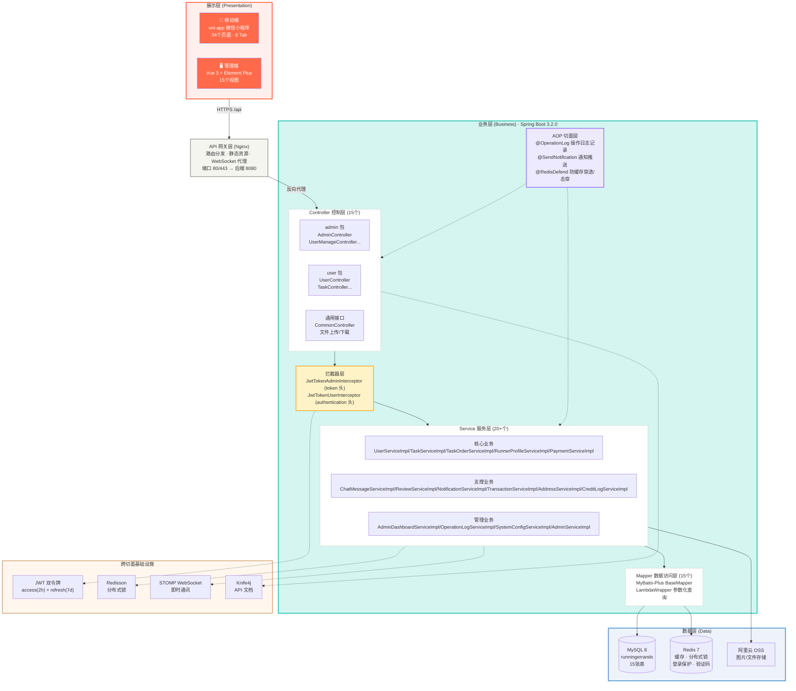
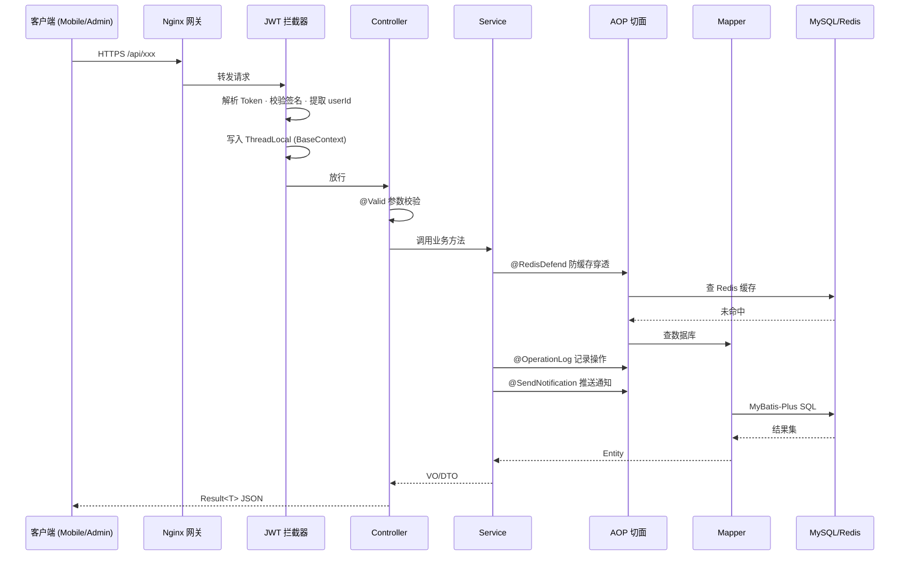
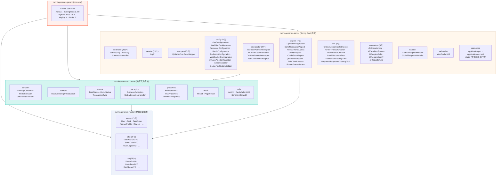
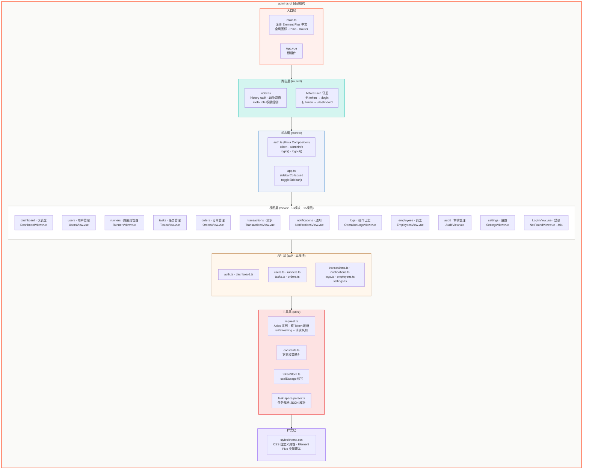
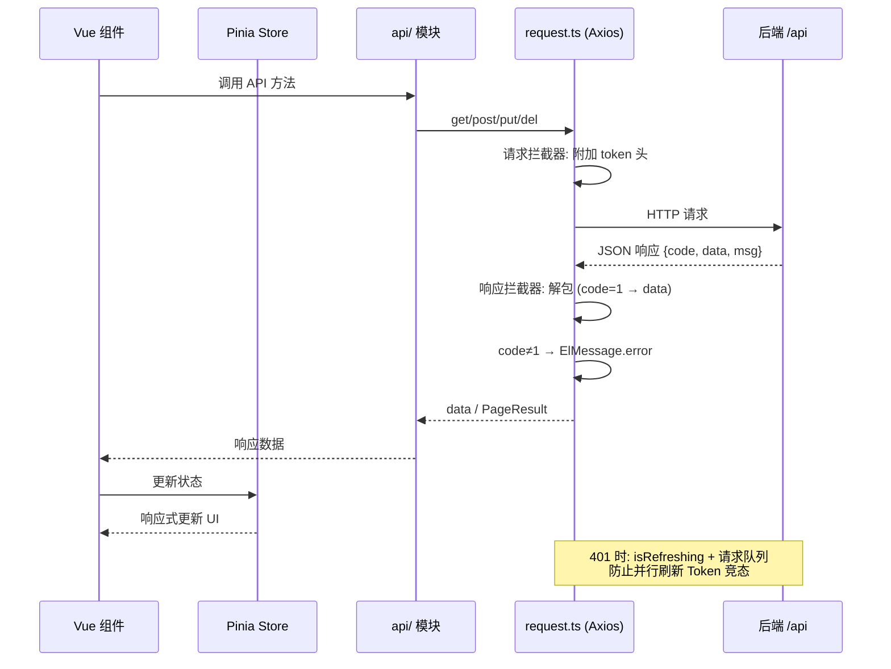
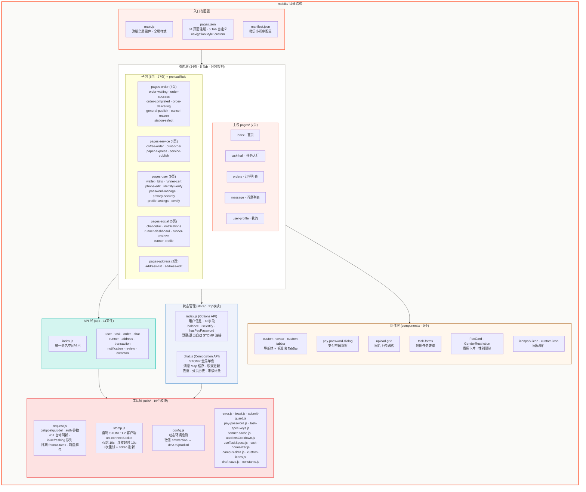
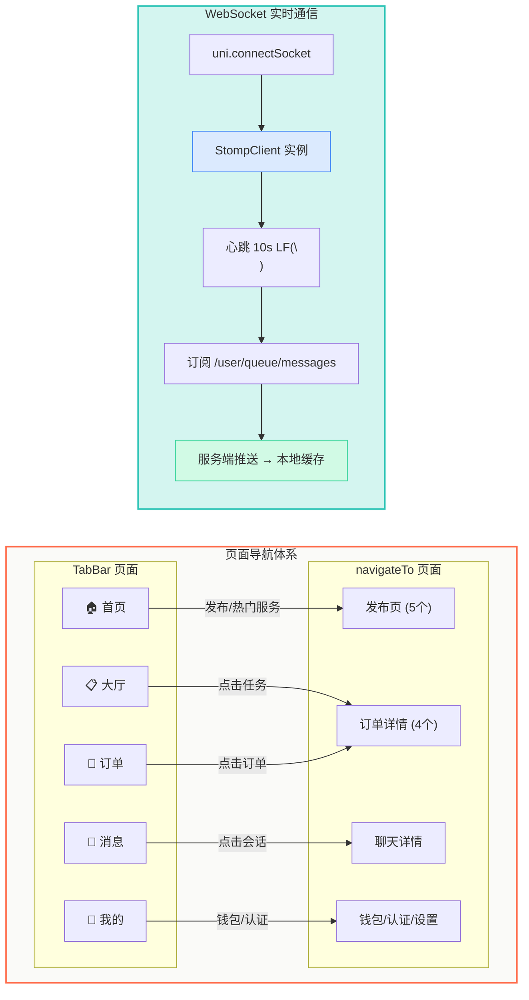

# 项目架构设计图

> 本文档展示小i跑腿平台的系统架构设计，涵盖整体三层架构、后端 Maven 模块结构、管理端与移动端前端架构。

---

## 系统整体架构图

> 三层架构：展示层 → 业务层 → 数据层的完整调用链路与跨切面基础设施



### 请求生命周期



---

## 后端 Maven 模块架构图

> Maven 多模块结构：common → model → server 的三层依赖关系



### Maven 依赖关系

| 模块 | 依赖 | 职责 |
|------|------|------|
| `runningerrands-common` | 无外部模块依赖 | 通用工具：常量、枚举、异常、结果封装、JWT 工具类 |
| `runningerrands-model` | `common` | 数据模型：Entity (15)、DTO (29)、VO (28) |
| `runningerrands-server` | `common` + `model` | Spring Boot 应用：Controller、Service、Mapper、配置、拦截器 |

### Server 模块核心包结构

```
com.ikeu.server/
├── RunningErrandsApplication.java       # SpringBoot 启动类
├── controller/
│   ├── admin/                           # 管理端接口 (11个)
│   │   ├── AdminController.java         # 管理员账号
│   │   ├── AdminDashboardController.java # 仪表盘
│   │   ├── AdminRunnerController.java   # 跑腿员管理
│   │   ├── AdminTaskController.java     # 任务管理
│   │   ├── AdminOrderController.java    # 订单管理
│   │   ├── AdminUserController.java     # 用户管理 (含审核)
│   │   ├── TransactionController.java   # 资金流水
│   │   ├── NotificationController.java  # 消息管理
│   │   ├── OperationLogController.java  # 操作日志
│   │   ├── EmployeeController.java      # 员工管理
│   │   └── SettingsController.java      # 系统设置
│   ├── user/                            # 用户端接口 (9个)
│   │   ├── UserController.java          # 用户注册/登录
│   │   ├── TaskController.java          # 任务发布/浏览
│   │   ├── OrderController.java         # 订单操作
│   │   ├── TaskOrderController.java     # 订单状态
│   │   ├── ChatController.java          # 即时通讯
│   │   ├── AddressController.java       # 收货地址
│   │   ├── ReviewController.java        # 评价系统
│   │   ├── RunnerController.java        # 跑腿员功能
│   │   └── UserTransactionController.java # 充值/提现
│   └── CommonController.java            # 文件上传/通用接口
├── service/
│   └── impl/                            # 21 业务实现类
├── mapper/                              # 15 个 MyBatis-Plus Mapper
├── config/                              # 9 个配置类
├── interceptor/                         # 4 个拦截器
├── aspect/                              # 7 个 AOP 切面
├── annotation/                          # 5 个自定义注解
├── handler/                             # GlobalExceptionHandler · GlobalResponseHandler
├── util/                                # RedisDefendUtil · WebUtil
├── task/                                # 6 个定时任务
└── websocket/                           # WebSocket 工具
```

---

## 管理端前端架构设计图

> Vue 3 + TypeScript + Element Plus · Vite 构建 · 15个视图



### 请求响应数据流



---

## 移动端前端架构设计图

> uni-app (Vue 3) 微信小程序 · 34个页面 · 5 Tab · STOMP WebSocket



### 页面跳转与数据流



### 页面分层职责

| 层级 | 文件 | 职责 |
|------|------|------|
| **页面层** | `pages/` (7) + 5 子包 (27) = 34 .vue | 页面模板 · 生命周期 · 用户交互 · 调用 API |
| **API 层** | `api/` (11个 .js) | 封装 HTTP 请求 · 统一认证头注入 · 响应解包 |
| **状态层** | `store/` (2个 .js) | 全局用户状态 · STOMP 连接管理 · 消息缓存 |
| **组件层** | `components/` (9个) | 导航栏 · TabBar · 支付密码 · 上传 · 表单 · 图标 |
| **工具层** | `utils/` (16个 .js) | HTTP 客户端 · STOMP · 错误处理 · toast · 防重复提交 |
| **配置层** | `main.js · pages.json · manifest.json` | 应用入口 · 页面注册 · 子包配置 · 预加载规则 |

---

## 技术栈全景图

```mermaid
flowchart LR
    subgraph FRONTEND["前端技术栈"]
        direction TB
        subgraph MOBILE_TECH["📱 移动端"]
            direction TB
            M1["框架: uni-app (Vue 3)"]
            M2["状态: Pinia"]
            M3["通信: 自制 STOMP 1.2"]
            M4["平台: 微信小程序"]
            M5["样式: CSS 自定义属性"]
        end
        subgraph ADMIN_TECH["🖥️ 管理端"]
            direction TB
            A1["框架: Vue 3.5 + TypeScript"]
            A2["UI: Element Plus 2.14"]
            A3["构建: Vite 8"]
            A4["图表: ECharts 6 + vue-echarts"]
            A5["动画: GSAP 3"]
            A6["状态: Pinia 3"]
        end
    end

    subgraph BACKEND["后端技术栈"]
        direction TB
        B1["语言: Java 21"]
        B2["框架: Spring Boot 3.2.0"]
        B3["ORM: MyBatis-Plus 3.5.5"]
        B4["数据库: MySQL 8"]
        B5["缓存: Redis 7 + Redisson"]
        B6["认证: JWT 双令牌"]
        B7["文档: Knife4j + springdoc"]
        B8["构建: Maven Wrapper"]
    end

    subgraph DEPLOY["部署与运维"]
        direction TB
        D1["容器: Docker + Docker Compose"]
        D2["网关: Nginx"]
        D3["存储: 阿里云 OSS"]
        D4["CI/CD: GitHub Actions"]
    end

    FRONTEND --> BACKEND --> DEPLOY

    style FRONTEND fill:#FFF0ED,stroke:#FF6B4A,stroke-width:3px
    style BACKEND fill:#D4F5F0,stroke:#2EC4B6,stroke-width:3px
    style DEPLOY fill:#EEF2FB,stroke:#5B9BD5,stroke-width:3px
    style MOBILE_TECH fill:#FF6B4A,color:#FFFFFF,stroke:#FF6B4A
    style ADMIN_TECH fill:#FF6B4A,color:#FFFFFF,stroke:#FF6B4A
```



---

> **文档说明**：以上架构设计图基于项目实际代码结构（`backend/` Maven 多模块、`admin/src/` Vue 3 目录、`mobile/` uni-app 目录）绘制。所有 Mermaid 图表可在支持 Mermaid 渲染的 Markdown 阅读器中直接预览。
